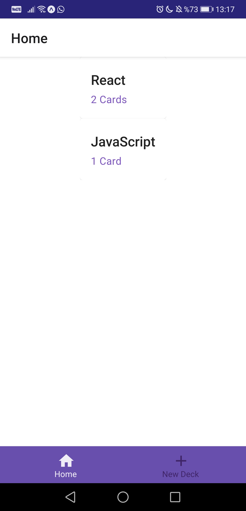
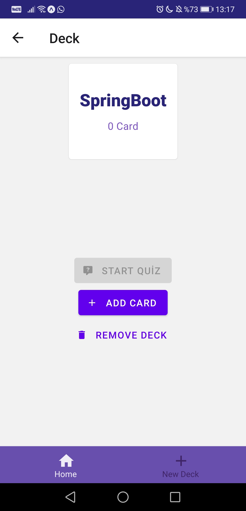
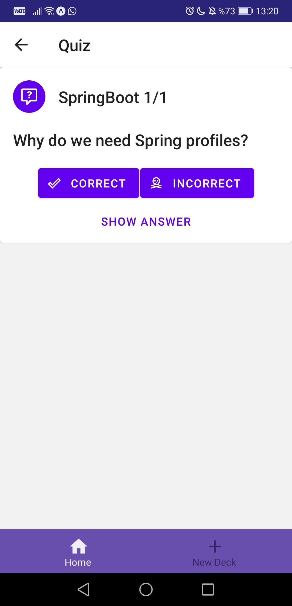
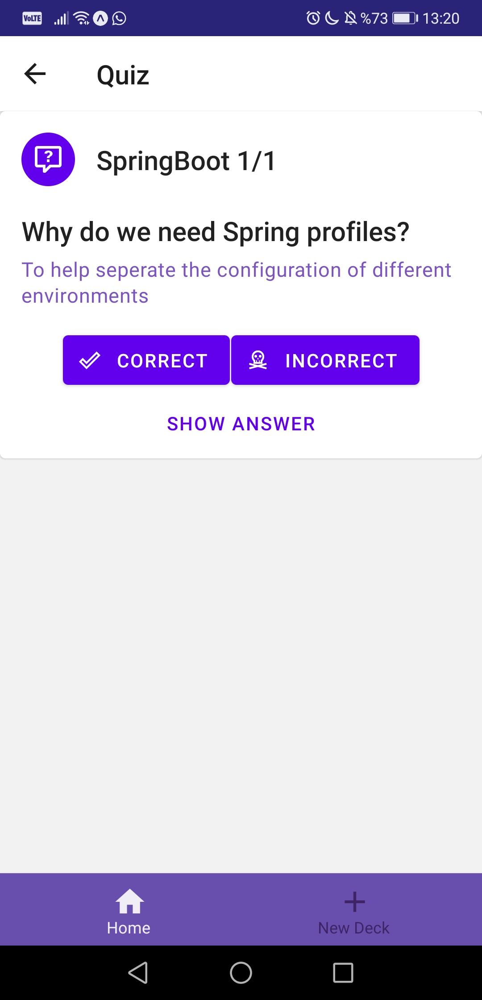

# Mobile Flashcards

The implementation of the final assessment project for Udacity's React nanodegree program. The project provides a simple app (Mobile Flashcards) that users can guess the answers through a deck of cards to earn score and provide more question cards and decks to the app. 

<div style="display: flex;">




</div>

> **Tested with Android 10 (Huawei P20 Pro CLT-L09)**

## Prerequisites

* Expo 3.28.1 or newer
* npm 6.14.6 or newer

## How to build and run

To get started running the project right away:

* Install all project dependencies with `expo install`
* Start the app with `expo start`

## Project Layout
```bash
├── CONTRIBUTING.md
├── README.md - This file.
├── index.js # You should not need to modify this file. It is used for DOM rendering only.
├── package.json # npm package manager file. It's unlikely that you'll need to modify this.
├── App.js # This is the root of the app. Contains root view and navigational components.
├── actions
│   └── index.js # Provides actions and related handlers
├── reducers
│   └── index.js # Reducers for related actions
├── middleware
│   ├── index.js # Applies middleware for the store
│   └── logger.js # Provides logging during dispatching actions
├── utils
│   ├── api.js # Provides CRUD methods for decks and cards
│   └── colors.js # Colors used system-wide
│   └── helpers.js # Helper methods to manage local notifications
└── components
    ├── Deck.js # A component to display deck title, number of question cards and provides buttons for adding card, removing deck or starting quiz.
    ├── DeckList.js # A component to display all decks to be used as a home screen.
    ├── NewDeck.js # A component to create a new deck.
    ├── NewQuestion.js # A component to create a new question card for a specific deck.
    ├── Quiz.js # A component to test users' knowledge about a deck of cards.
    ├── UdaciStatusBar.js # A helper component that displays a status bar.
```
